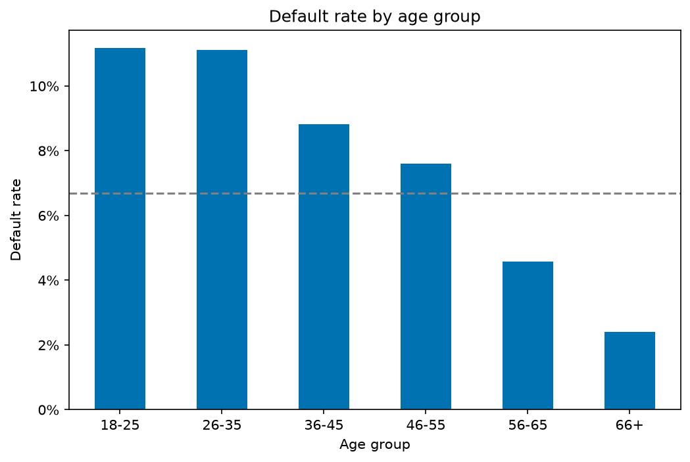
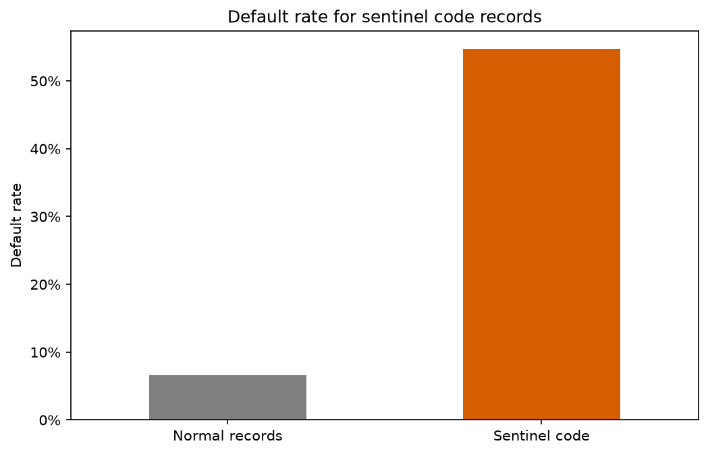
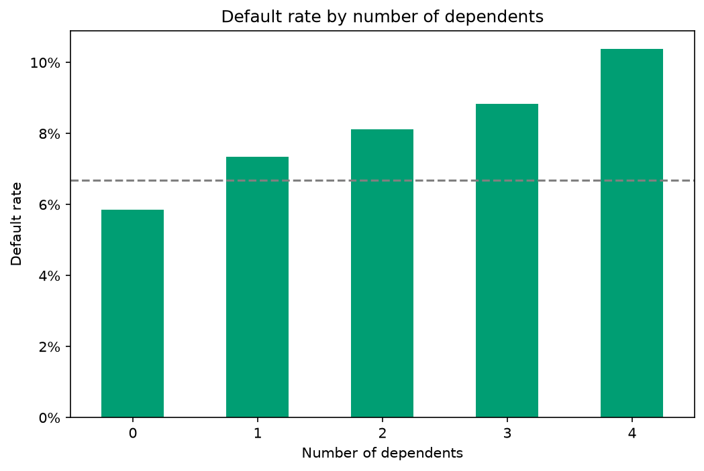
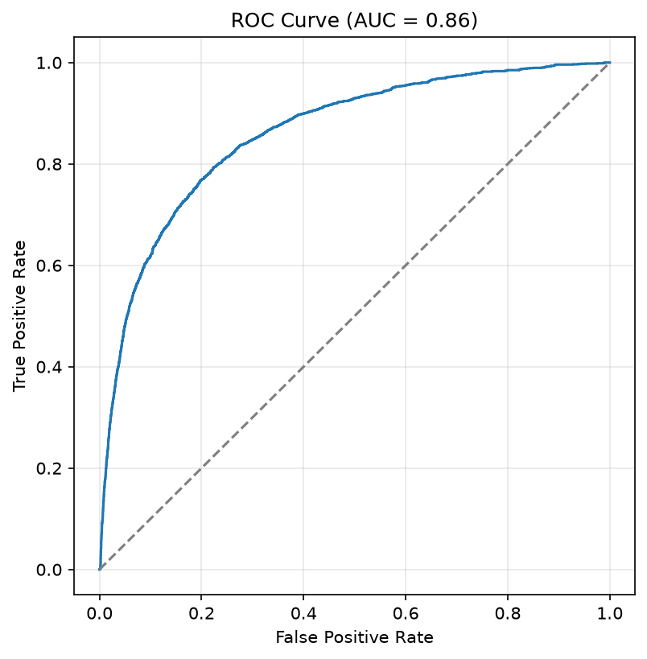
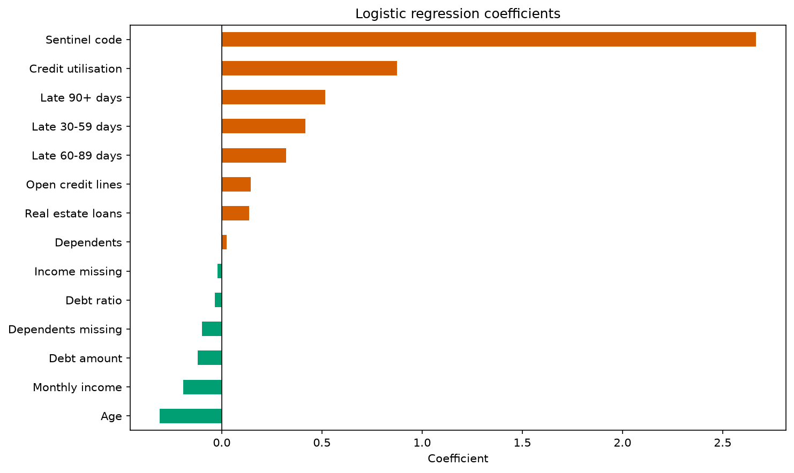

# Credit scoring on the "Give Me Some Credit" dataset

A logistic regression model predicting whether a borrower will fall 90 or
more days behind on a payment within the next two years, built on 150,000
records. The final model reaches an **AUC of 0.86** and recovers 73% of
defaulters on held-out data. The project puts most of its effort into
understanding the data before modelling: the strongest single predictor
turned out to be a group of **269 records** that a routine cleaning step would
have deleted.

## Summary

The dataset comes from a 2011 Kaggle competition and has the usual problems
of real lending data: informative missing values, a column holding two
different quantities, sentinel codes disguised as counts and a 1:14 class
imbalance. Each of these was investigated in SQL and pandas before any
decision was made, and every decision is recorded with the number that
justified it, both in the EDA notebook and as comments in the cleaning
code.

The pipeline is split into modules by whether an operation can see the
whole dataset or only the training split, which is what keeps test
information out of the model. Missing values are flagged before they are imputed, because in two columns the absence itself predicted default, and in a third a status code disguised as a count turned out to be the strongest predictor of all. The resulting model is deliberately simple, since in credit
scoring a coefficient that can be explained to a regulator is worth more
than a few points of accuracy.

## Data

The data is the training set from the Kaggle competition
[Give Me Some Credit](https://www.kaggle.com/c/GiveMeSomeCredit): 150,000
borrowers, 10 features and a binary target. The features describe a
borrower's finances at one point in time: age, monthly income, number of
dependents, how much of their available credit they are using, their debt
to income ratio, how many credit lines and real estate loans they hold,
and how many times they have been 30-59, 60-89 and 90+ days late on a
payment.

The target, `SeriousDlqin2yrs`, is 1 if the borrower went 90 or more days
past due within the following two years. In lending this is the usual
working definition of default: at 90 days the account is normally passed
to collections and the loan is treated as impaired. **6.68% of borrowers**
default, so the classes are imbalanced at roughly 1:14.

The CSV is not committed to the repository. Download `cs-training.csv`
from Kaggle and place it in `data/`.

## Exploration in SQL

The first pass over the data was done in SQL rather than pandas, since in
practice lending data lives in a database. `src/db.py` loads the CSV into
a SQLite table and `src/queries.sql` holds the queries, which established
four things:

- The overall default rate and class imbalance.
- That income is missing for 19.8% of borrowers and that these borrowers
  default **less** often (5.61% against 6.95%), so the missing flag is a
  feature rather than noise.
- That age runs from 0 to 109, with a single record at 0 used as a
  placeholder.
- The default rate by age band, using a reference table joined on
  `BETWEEN` and a `HAVING` clause to drop bands too small for the rate to
  mean anything. Default rate falls monotonically with age, from 11.2% in
  the youngest band to 2.4% in the oldest.



The findings were then carried into pandas for the detailed work in
`notebooks/01_eda.ipynb`.

## Data quality and cleaning decisions

Every problem below was measured before it was fixed. The numbers are
reproduced in `notebooks/01_eda.ipynb` and the fixes are implemented, with
the same numbers as comments, in `src/data.py`.

### Sentinel codes in the delinquency counters

The three "number of times late" columns run smoothly from 0 to 17 and
then jump to **269 records** holding the values 96 or 98. These are not
counts. The same 269 rows carry a code in all three columns at once,
which no real borrower can do, and the values match the convention in
older banking systems of reserving high two-digit codes for account
statuses such as "in collections" or "charged off".

The obvious fix is to delete them, at 0.18% of the data nobody would
notice. Their default rate is **54.6%**, against a baseline of 6.68%.
They are the single riskiest group in the dataset, and deleting them
would have removed the strongest signal available. Instead the codes are
replaced with 0 and a binary `sentinel_code` flag marks the affected rows.
The flag carries the risk; the zero keeps the counter neutral so the
model is not told the same thing twice.



### DebtRatio holds two different quantities

`DebtRatio` should be debt payments divided by income, so values near 1
mean the borrower spends most of their income on debt. Of the 31,045
records above 2, some 27,744 have no income recorded, and their median
`DebtRatio` is **1,159**. A ratio of over a thousand is not a ratio. Where
income was not reported, the source system wrote the raw debt amount into
this column instead.

The two quantities are separated: the amounts move to a new `debt_amount`
column and `DebtRatio` is cleared for those rows, then imputed with the
training median. `debt_amount` is 0 for borrowers who reported an income,
which means "does not apply" rather than "unknown"; the `income_missing`
flag tells the two cases apart.

### Missing values that predict default

Missing income and missing dependents are both informative. Borrowers
with no income recorded default at 5.61% against 6.95%; borrowers with no
dependents recorded default at **4.56% against 6.74%**. In both cases the
absence is flagged before the value is imputed, so the model keeps the
signal instead of losing it under a median.

Income is imputed with the training median (5,400). Dependents are imputed
with 0, which is both the median and the mode of an integer count, and
values of 5 and above are collapsed into one category because above four the default rate stops rising and the groups thin out fast, from 746 records at five to 51 at seven.



### Utilisation above 100%

`RevolvingUtilizationOfUnsecuredLines` is the share of available credit a
borrower is using, so it should sit between 0 and 1. It goes above 1 for
3,321 records, which is plausible (fees and interest can push a balance
past its limit), but above **10** for only 241, with values in the
thousands. Those 241 default at 7.05%, essentially the baseline, so they
carry no signal and are capped at 10 rather than flagged or removed.

### One impossible record

A single borrower has an age of 0. It is dropped by a filter on
`age > 0` rather than by row number, so the rule holds if the data is
refreshed.

## Model

The model is a logistic regression, which is the standard choice in credit
scoring for a reason unrelated to accuracy. A lender has to be able to
explain a refusal, and in many jurisdictions is required to by law. A
model that produces one coefficient per feature can be explained; a model
that outperforms it by two points of AUC but cannot be explained is not
usable.

Three decisions shape the training:

- **Class weighting** rather than resampling. With defaults at 6.68%, a
  model that approves everyone is 93% accurate and useless. Setting
  `class_weight="balanced"` tells the model that missing a defaulter
  costs more than rejecting a good borrower, without discarding data
  (undersampling) or inventing borrowers (SMOTE), both of which are hard
  to defend in a regulated setting.
- **Standardisation of continuous features only.** Income is in the
  thousands and the flags are 0 or 1, which makes the optimiser struggle
  and the regularisation penalty uneven. The eleven continuous columns
  are standardised; the three binary flags are left alone so their
  coefficients read directly as the effect of having that property.
- **Every statistic learned from the training split only.** The data is
  split 80/20 with stratification before any median or scaling mean is
  computed. The pipeline is organised around this: `src/data.py` holds
  the row-level operations that can safely run on the full dataset,
  `src/features.py` holds everything that must wait for the split.

## Results

On the 30,000 held-out borrowers:

| Metric | Value |
|---|---|
| AUC | **0.86** |
| Recall | 73.1% |
| Precision | 23.5% |

The confusion matrix at the default threshold of 0.5:

|  | Predicted good | Predicted default |
|---|---|---|
| **Actually good** | 23,223 | 4,772 |
| **Actually default** | 540 | 1,465 |

The model catches roughly three defaulters in four. The price is 4,772
good borrowers refused, and precision of 23.5% means three out of four
refusals are unnecessary. That trade-off is a direct consequence of class
weighting and is the one a lender usually wants: a refused good borrower
costs the margin on one loan, a missed defaulter costs the principal.

Whether the trade is worth it is a business question, not a modelling
one. The model returns a probability, and the threshold at which a
probability becomes a refusal belongs to whoever owns the loan book.
Lowering it from 0.5 to 0.3 would catch more defaulters at the cost of
more refusals; raising it does the opposite. AUC of 0.86 says that
whichever threshold is chosen, the ranking of borrowers underneath it is
sound. In the Gini scale more common in banking that is 0.72.




The coefficients confirm what the exploration found. Age and income protect; all three delinquency counters raise risk, with the 90+ day counter the strongest of them; utilisation is the second strongest feature overall. At the top, three times larger than anything else, is the **sentinel code flag**: the 269 records that a routine cleaning step would have discarded.



## Limitations

- The thresholds of 10 for utilisation and 5 for dependents were chosen
  by inspecting the full dataset, including rows that later became the
  test set. Strictly, exploratory analysis should be confined to the
  training split. The effect here is negligible, but it is a form of
  leakage and is named as such.
- `DebtRatio` is imputed with the training median, which assumes that
  borrowers who did not report income have similar debt ratios to those
  who did. The exploration suggests they are a lower-risk group, so that
  assumption is questionable.
- `debt_amount` is 0 for four fifths of borrowers and holds a real amount
  only where income is missing. Its coefficient is therefore partly a
  proxy for belonging to that group rather than a clean effect of debt
  size.
- The scaler and the imputation medians live only inside the pipeline.
  In deployment they would need to be saved alongside the model, since a
  new applicant must be transformed with the statistics the model was
  trained on.
- One model, one threshold, no hyperparameter tuning and no comparison
  with gradient boosting. The aim was a defensible baseline, not the best
  possible AUC.

## How to run

```bash
git clone https://github.com/Matus1ak/credit-scoring.git
cd credit-scoring
python -m venv .venv
source .venv/bin/activate
pip install -r requirements.txt
```

Download `cs-training.csv` from
[Kaggle](https://www.kaggle.com/c/GiveMeSomeCredit/data) into `data/`, then:

```bash
python main.py
```

This cleans the data, trains the model, prints the confusion matrix and
metrics, and writes both model figures to `reports/figures/`.

To reproduce the SQL exploration, build the SQLite database first:

```bash
python src/db.py
sqlite3 data/credit.db < src/queries.sql
```

## Repository structure

```
credit-scoring/
├── data/                 # cs-training.csv and credit.db (not committed)
├── notebooks/
│   └── 01_eda.ipynb      # exploratory analysis with all decisions
├── reports/figures/      # five figures referenced above
├── src/
│   ├── db.py             # CSV to SQLite
│   ├── queries.sql       # SQL exploration
│   ├── data.py           # row-level cleaning, runs on full dataset
│   ├── features.py       # split, imputation, scaling (train-only stats)
│   ├── models.py         # logistic regression
│   └── evaluate.py       # metrics and figures
├── main.py               # runs the whole pipeline
└── requirements.txt
```
